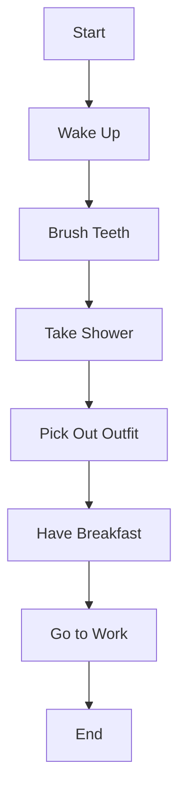

# Morning Routine Flowchart 

### Description of Steps

1. **Start**: Begin the morning and start routine.
2. **Wake Up**: First thing to do every day. 
3. **Brush Teeth**: First part of multiple step hygiene process. 
4. **Take Shower**: Second part of multiple step hygiene process.
5. **Pick Out Outfit**: Choose which outfit best fits your plans for the day. 
6. **Have Breakfast**: The most important meal of the day! 
7. **Go to Work**: Final step in the process before beginning the rest of the day. 
8. **End**: Last step to complete the flowchart for a morning routine. 
